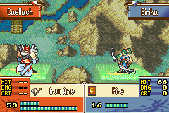
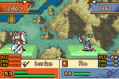

# Banim command expansion

Just include **BanimCmdExpansion.event**, then you may use such expanded command in your banim scripts:

- `C0E (FakeHitRed): `
Call for a fake hit (flashing BG) the same as C51, but with red color and hold a longer duration (C51 holds 5 frams but C0E holds 16 frams)

- `C0F (FakeHitBlack): `
Call for a fake hit (flashing BG) the same as C51, but with black color and hold a longer duration (C51 holds 5 frams but C0F holds 16 frams)

- `C16 (CallDK): `
Freeze the anim until the DemoKing has been summoned in background. You must call for `C17` to remove it.

- `C17 (RemoveDK): `
Freeze the anim to remove the summoned DemoKing by `C16`

- `C53 (CallDuma): `
Freeze the anim until the dragon-Duma has been summoned in background. You must call for `C54` (or `C17` or `C54`) to remove it.

- `C54 (RemoveDuma): `
Freeze the anim to remove the summoned Duma by `C53`

- `C55 (RemoveDumaNonBlocking) : `
The same as `C54`, but will not freeze the anim.
